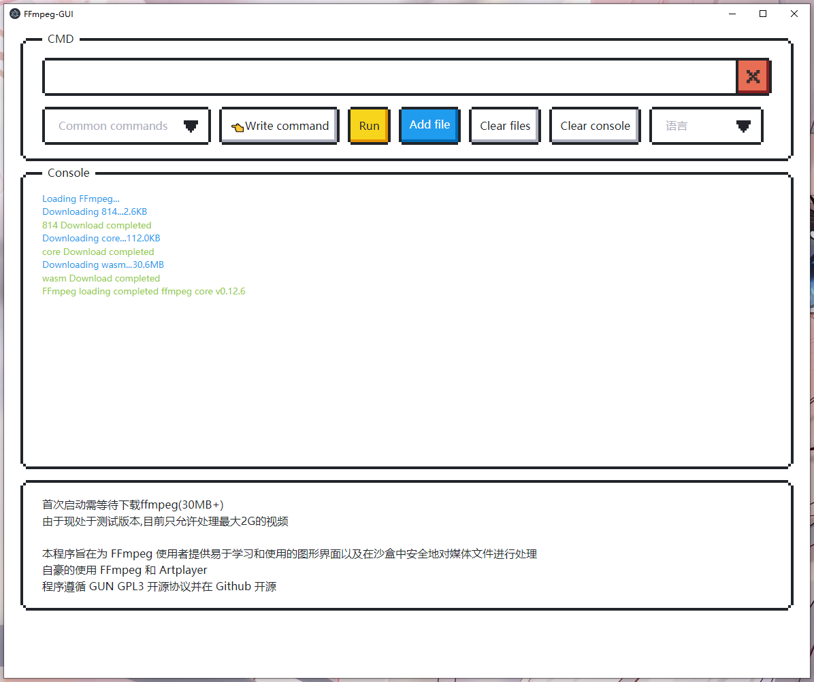

# FFmpeg-GUI

[简体中文](README-zh.md)

A simple and easy-to-use graphical user interface (GUI) for FFmpeg that helps you easily perform video and audio conversion, editing, merging, and other operations.

### Screen

